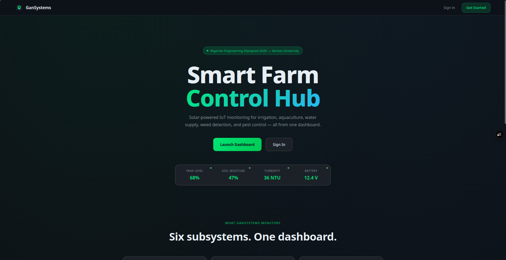
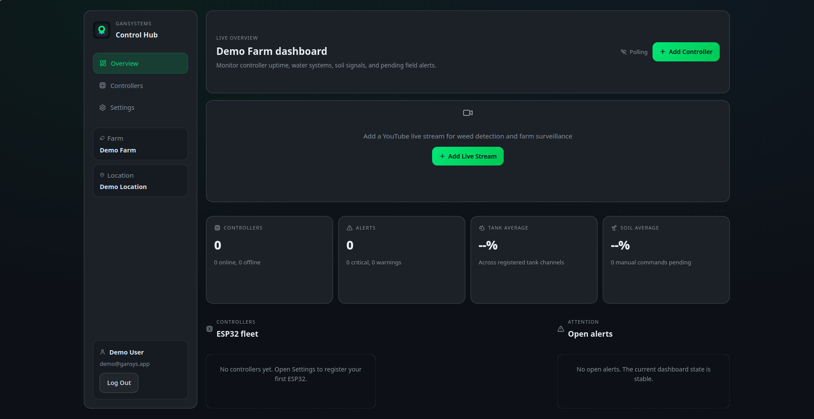
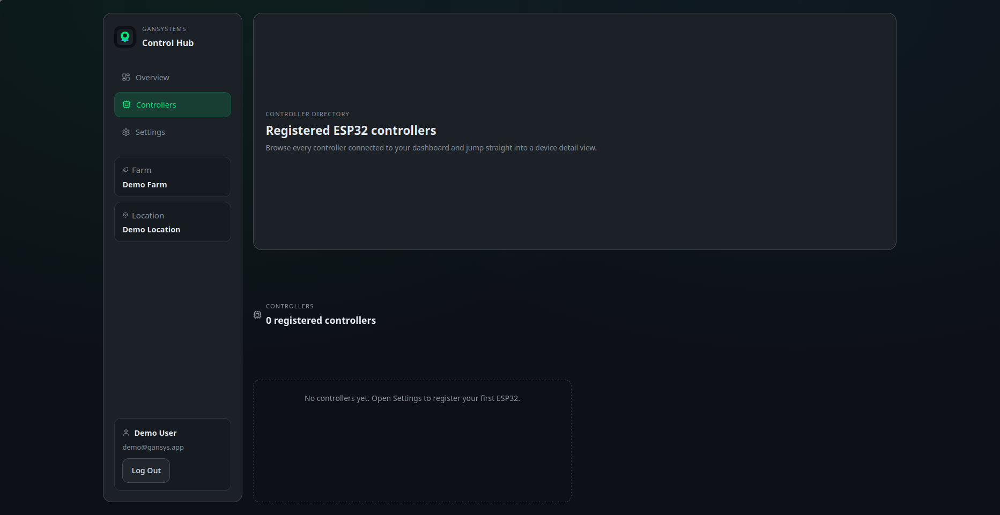
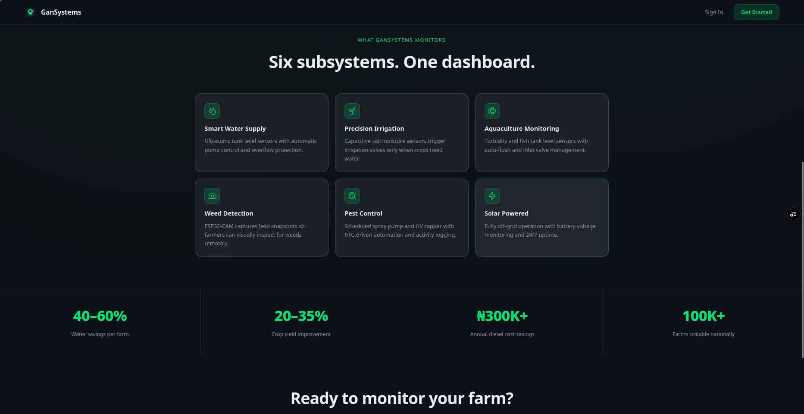
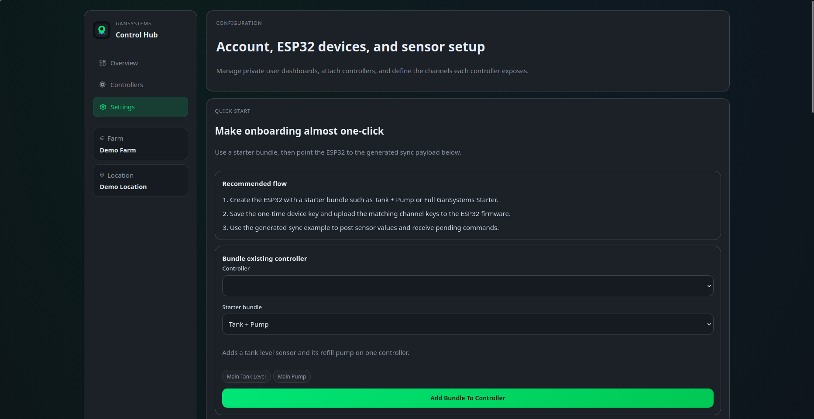

# 🌱 GanSystems Dashboard



GanSystems is an AI-powered IoT farm management platform designed to automate agricultural operations through ESP32-based controllers, real-time telemetry monitoring, remote device management, and intelligent irrigation and pest-control scheduling.

The platform provides farmers, agricultural organizations, and researchers with a centralized dashboard for monitoring field conditions, controlling connected devices, analyzing telemetry data, and managing farm automation workflows from anywhere.

---

## 🌐 Live Demo

**Website:** https://gansystem.vercel.app

### Demo Account

```text
Email: demo@gansys.app
Password: demo1234
```

---

# 🚀 Project Overview

Modern agriculture increasingly depends on connected devices and real-time monitoring to improve productivity while reducing water, fertilizer, and labor costs.

GanSystems was developed as an end-to-end IoT dashboard that connects ESP32 field controllers with a cloud-based monitoring platform.

The system enables users to:

* Monitor farm devices remotely
* Track sensor telemetry
* Control irrigation systems
* Schedule automated operations
* Manage pest-control spraying
* Receive real-time updates
* Analyze historical farm data

---

# ✨ Key Features

## Authentication & User Management

* User registration
* Login and logout
* Session-based authentication
* Protected dashboard access

## Farm Controller Management

* Register ESP32 controllers
* Manage connected devices
* Monitor controller health
* Device synchronization

## Real-Time Monitoring

* Live telemetry updates
* Soil monitoring
* Water level tracking
* Sensor status monitoring
* Controller activity tracking

## Irrigation Automation

* Pump control
* Irrigation scheduling
* Automated watering workflows
* Remote actuator management

## Pest Control Automation

* Scheduled spraying
* Pest-control activity tracking
* Automated command execution
* Spray cycle monitoring

## Dashboard Analytics

* Historical telemetry charts
* Device statistics
* Alert monitoring
* Activity summaries
* System performance metrics

## Camera Integration

* Camera snapshots
* Remote image monitoring
* Visual farm inspection support

## Real-Time Communication

* MQTT integration
* WebSocket updates
* Live dashboard synchronization
* Device acknowledgement tracking

---

# 📸 Screenshots

## Dashboard Overview



## Controller Management



## Telemetry Monitoring



## Settings & Device Registration



---

# 🛠 Technologies Used

### Frontend

* Next.js 16
* React 19
* TypeScript
* CSS
* Recharts

### Backend

* Next.js API Routes
* Node.js
* Custom WebSocket Server
* MQTT Integration

### Database

* PostgreSQL
* Neon Database
* Drizzle ORM

### IoT & Embedded Systems

* ESP32
* MQTT Protocol
* Sensor Telemetry
* Device Synchronization

### Validation & Security

* Zod
* Session Authentication
* Route Protection

---

# 🏗 System Architecture

GanSystems consists of three primary layers:

### 1. IoT Device Layer

ESP32 controllers deployed in the field collect:

* Soil data
* Water-level data
* Environmental readings
* Device status information

### 2. Cloud Platform Layer

Handles:

* Device synchronization
* Data processing
* Telemetry storage
* MQTT communication
* Authentication

### 3. Dashboard Layer

Provides:

* Monitoring
* Visualization
* Automation controls
* Reporting
* Device management

---

# 📂 Project Structure

```text
gansystem/
├── app/
├── src/
├── drizzle/
├── scripts/
├── tests/
├── docs/
├── GanSys/
├── c++/
├── screenshots/
├── server.ts
├── package.json
└── README.md
```

---

# 🔥 Major Capabilities

### Remote Farm Management

Control and monitor agricultural systems from anywhere.

### Automated Irrigation

Reduce water waste through scheduled irrigation workflows.

### Pest-Control Scheduling

Automate pest-control operations and reduce manual intervention.

### Live Telemetry

Receive real-time updates from connected field devices.

### Device Synchronization

Maintain controller configuration and firmware synchronization.

### Historical Analytics

Analyze trends and optimize farm operations using collected telemetry.

---

# 👨‍💻 My Contributions

As a developer on GanSystems, I contributed to:

* Full-stack application development
* Dashboard architecture
* IoT device integration
* ESP32 communication workflows
* MQTT messaging implementation
* WebSocket real-time updates
* PostgreSQL database integration
* Drizzle ORM configuration
* API development
* Telemetry visualization
* Farm automation workflows
* User authentication
* Responsive UI implementation

---

# 🎯 Real-World Applications

GanSystems can be adapted for:

* Smart Irrigation Systems
* Precision Agriculture
* Greenhouse Monitoring
* Fish Farming Automation
* Agricultural Research
* Smart Farm Management
* Remote Environmental Monitoring

---

# 🚀 Deployment

Production deployment requires:

* Node.js runtime
* PostgreSQL database
* MQTT broker (optional)
* WebSocket support

Build:

```bash
npm run build
```

Start:

```bash
npm run start
```

---

# 📌 Repository Topics

```text
nextjs
react
typescript
iot
esp32
mqtt
websocket
postgresql
drizzle-orm
agritech
smart-farming
farm-automation
dashboard
realtime
precision-agriculture
```

---

# 🌍 Live Project

https://gansystem.vercel.app

---

# 👨‍💻 Developer

**Iyobosa Amaddin**

GitHub:
https://github.com/codeandbe

LinkedIn:
https://linkedin.com/in/codeandbe

---

# 📄 License

This repository is provided for portfolio and educational purposes.

Certain deployment credentials, infrastructure configurations, and production resources have been excluded from the repository.
